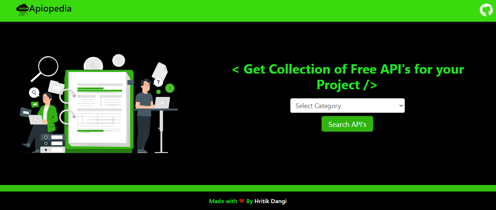

So Hey! 
We all face issues in searching categorised public Api's
So APIopedia (API + Encyclopedia) is a small but clean project where you can easily find out the all collection of API's with categories on one click.

you can check it out here- https://apiopedia.netlify.app

